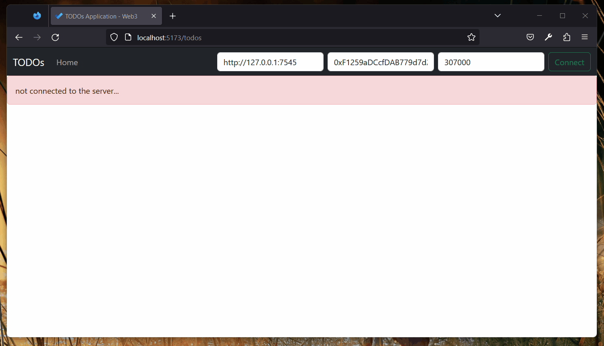
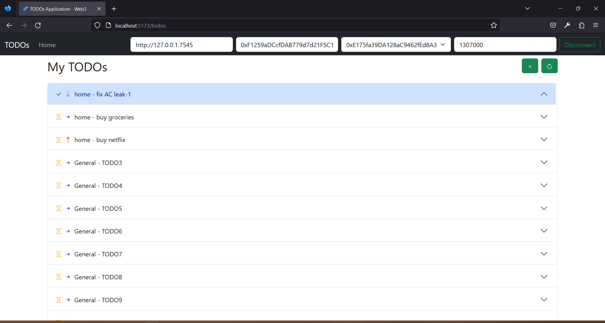
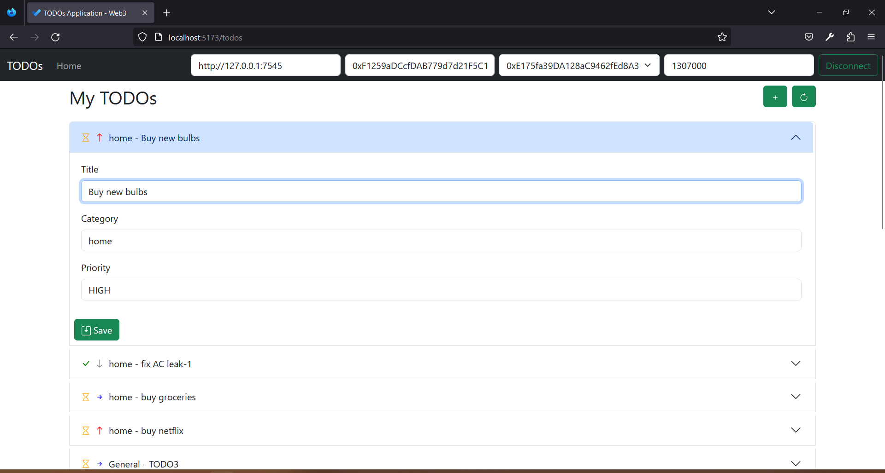
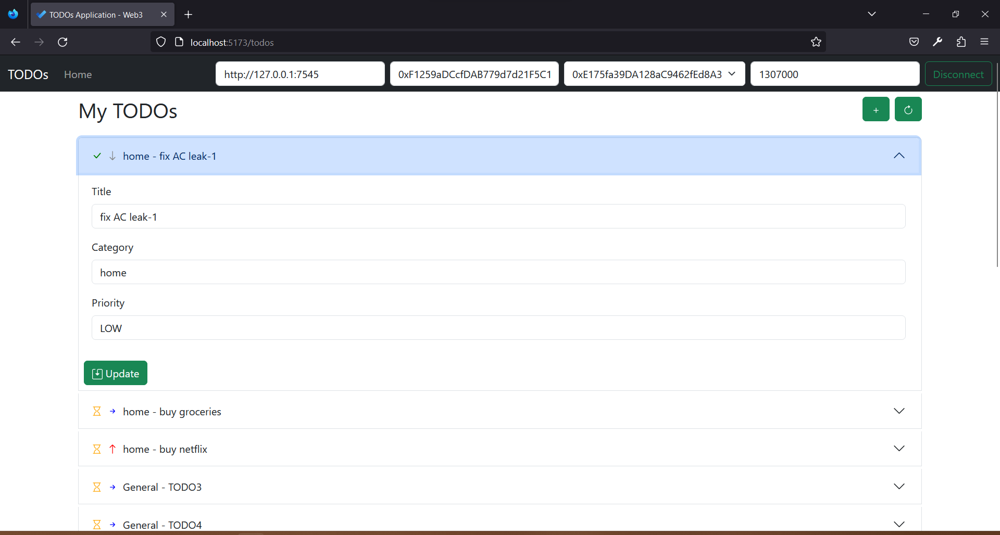
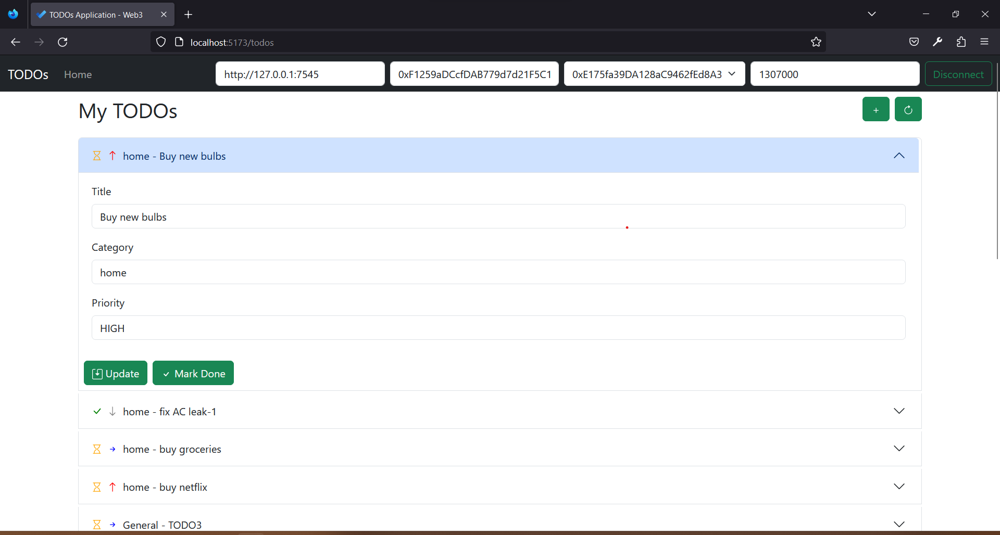
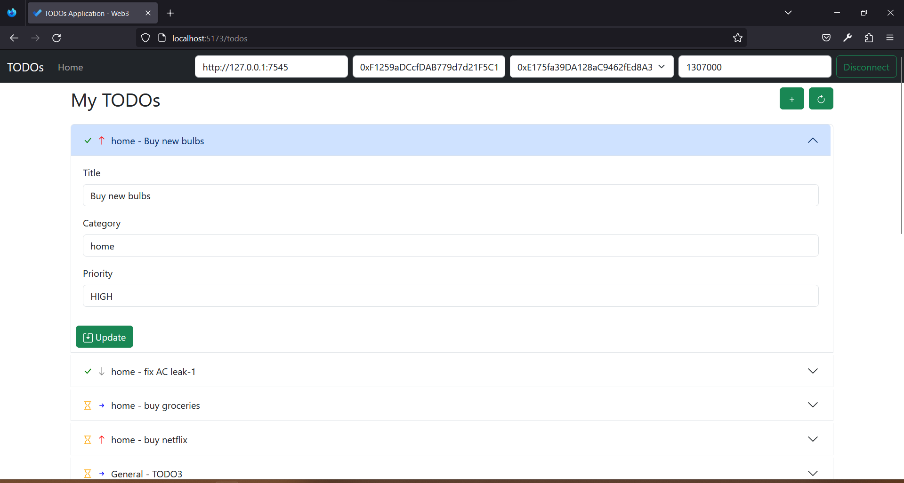
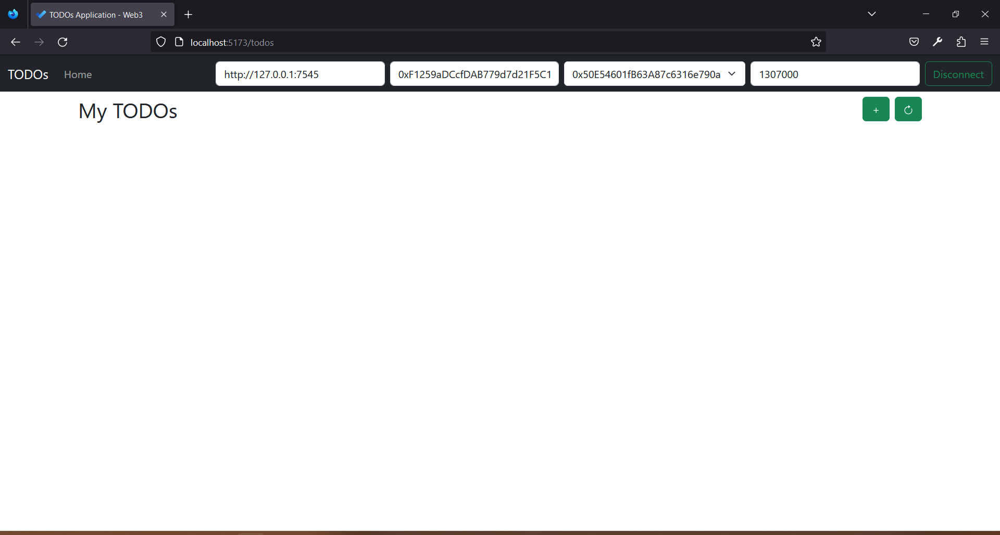
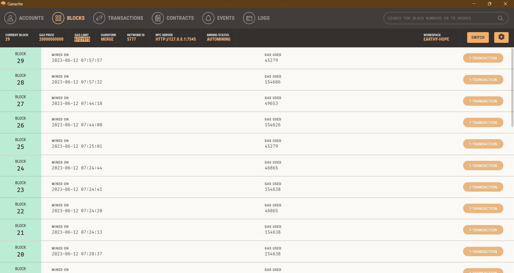

# TODO - web3 application to manage personal todos


## Architecture:

We use a Vue based SPA to interact with the EVM directly(Ganache in our case) using web3js.

Once the SPA is "connected" to the client given the server url, we should be able to perform the options, switch accounts and visualize the results.

## Smart Contract:

TODO smart contract is located in the folder "smartcontracts". Its provides the capabilities as below:

* add task
* update task - details
* update task as completed
* find todos for current user/account

## Compiling and Running the application:

* Start Ganache or other providers
* CD to ui folder and run the below commands

```shell
# install prerequisites
yarn install

# start dev server
vite

# navigate to the indicated url in a browser, its mostly - http://localhost:5173/
```

* Open Remix, open the TODO smart contract and deploy it to ganache. Copy the contract address and use it in the web user interface


## Walkthrough of the application:





## Step by Step - Walkthrough of the application:

* Connect to EVM (Ganache was used for testing)
	- At the top of the screen we see the below controls in order, we need to configure that
		- remix to publish the smart contract (located in smartcontracts folder)
		- url (ganache in our case)
		- contract address (copied from remix after deployment)
		- default gas limit to use (wei)
		- contract addresses after we "connect"
		- click on "connect" after giving all the details



* Once we click on the "Connect" button, we should see the list of tasks. If there are no Todos, need to click on "+" to add new one as shown below.



* Click on update to save changed details back to the Todo



* Click on "Mark Done" to mark the task as completed



* Completed tasks are shown with a "Tick" mark where as a pending ones are shown with an hourglass



* change the "current account" from the account drop down. Usually it might be empty as not tasks are available for the new account



* Ganache snapshot showing multipe mined blocks


