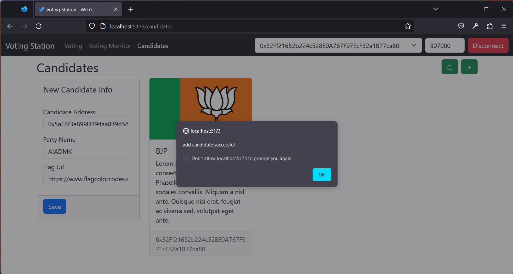

# Voting Station - web3 application to manage voting in a democracy


## Architecture:

We use a Vue based SPA to interact with the EVM directly(Ganache in our case) using web3js.

Once the SPA is "connected" to the client given the server url, we should be able to perform the operations, switch accounts to do role plays and visualize the results.

## Smart Contract:

Voting smart contract is located in the folder "smartcontracts". Its provides the capabilities as below:

* register a candidate
* manage voting process - allows candidate to register, starts voting and declares winner
* keeps track of who voted - does not allow dupe votes, tracks candidate to votes array - to find who voted for which party(candidate)
* tracks winner and winning results

## Compiling and Running the application:

* Start Ganache or other providers
* CD to ui folder and run the below commands

```shell
# install prerequisites
yarn install

# start dev server
vite

# navigate to the indicated url in the console, its mostly - http://localhost:5173/
```

* Open Remix, open the Voting smart contract and deploy it to ganache. Copy the contract address and use it in the web user interface


## Walkthrough of the application:

* Screen grab of full flow


## Walthrough of each screen:


* Ganache snapshot showing multipe mined blocks


* Connect to EVM (Ganache was used for testing)
	- At the top of the screen we see the below controls in order, we need to configure that
		- remix to publish the smart contract (located in smartcontracts folder)
		- url (ganache in our case)
		- contract address (copied from remix after deployment)
		- default gas limit to use (wei)
		- contract addresses after we "connect"
		- click on "connect" after giving all the details


* Registering Candidates


* Candidates registered


* Voting monitor screeen


* Starting the voting process


* Voting started and candidate votes tracked


* Voting - pick the party and "Cast Vote"


* Vote confirmed


* My vote view, cannot cast vote again and no duplicate votes possible


* Choose another account, and cast the vote


* cast another vote as another user


* Declaring results and automatically declare winner


* Voting completed and winner has been announced

